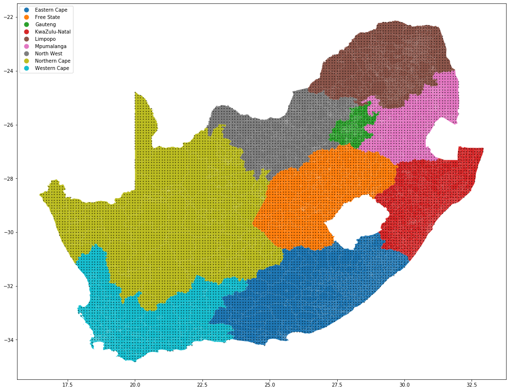

# Capstone Project: GeoCoding South Africa
### Udacity DataEngineering NanoDegree

## Motivation
At the time of writing, I could not find a good source with accurate information on ward, suburb, city, closest metropole and province in South Africa
The only feasible way of getting to that information from a set of latitude and longitude values is via an API - something that is not ideal when working with databases.
This aim of this project is to provide a lookup dataset onto which one can join with a (truncated) set of latitude/longitude values to obtain the information mentioned above.
Access to such a dataset means that it can be housed in a relational database and the information will be a standard SQL join away.


## Requirements
This project is built to run within the Udacity workspace environment using the helper script `setup.sh` which can be executed by either simply `./setup.sh` or `/bin/bash setup.sh`. **Do not run this script if you don't need to**.  
Once the setup script completes, ensure that you run `source capstone/bin/activate` before running the other python files to ensure that the right environment is active.

**Mac users:** use brew to install spatialindex like so: `brew install spatialindex`.
**Linux users:** run the following to install spatialindex `sudo apt install libspatialindex-dev`
You may need to reinstall rtree if you're having issues: `pip uninstall rtree && pip install rtree`

For most other applications, activating a new environment and installing the requirements using `pip install -r requirements.txt` should suffice.  If you're using __*anaconda*__, though, you're on your own.

## Raw data
To get the raw data, simply run `./get_data.sh` or `bash get_data.sh`.  The script will create a folder **data** containing the raw data used in this project.  
Sources:
- geonames dataset: http://www.geonames.org
- postal codes dataset: http://www.geonames.org
- wards data (mdb datasets): http://www.demarcation.org.za/site/ward-delimitation/

## About the raw data
### * Geography names dataset
To load the geonames dataset correctly, use the following code:
```
geo_cols = ['geonameid', 'name', 'asciiname', 'alternatenames', 'latitude', 'longitude',
            'feature_class', 'feature_code', 'country_code', 'cc2',
            'admin1_code', 'admin2_code', 'admin3_code', 'admin4_code',
            'population', 'elevation', 'dem', 'timezone', 'modification_date',]
geonames = pd.read_csv('data/geonames.tsv', sep='\t', names=geo_cols, dtype=object)
geonames['f_code'] = geonames.apply(lambda x: str(x.feature_class)+'.'+str(x.feature_code), axis=1)
geonames.head()
```

### * Geography features dataset
To load the geonames features dataset correctly, use the following code:
```
geofeats_cols = ['f_code','desc_short','desc_long']
geofeats = pd.read_csv('data/geonames_features.tsv', sep='\t', names=geofeats_cols)
geofeats.head()
```

To merge the above two datasets, use
```
geos = geonames.merge(geofeats, how='left',on='f_code')
geos[['latitude','longitude']] = geos[['latitude','longitude']].astype(float)
geos[['geonameid','population']] = geos[['geonameid','population']].astype(int)
geodf = gpd.GeoDataFrame(geos, geometry=gpd.points_from_xy(geos.longitude,geos.latitude))
geodf.head()
```

### * Postal Codes dataset
To load the geonames features dataset correctly, use the following code:
```
pc_cols = ['country_code', 'postal_code', 'place_name', 
           'admin_name1', 'admin_code1', 'admin_name2', 'admin_code2', 
           'admin_name3', 'admin_code3', 'latitude', 'longitude', 'accuracy',]
pc = pd.read_csv('data/postal_codes.tsv', sep='\t', names=pc_cols, dtype={1:object})
pc[['latitude','longitude']] = pc[['latitude','longitude']].astype(float)
pc_geo = gpd.GeoDataFrame(pc, geometry=gpd.points_from_xy(pc.longitude,pc.latitude))
pc_geo.head()
```

### * Wards 2016 dataset
The data from the MDB website for 2016.  Use the code below to load the data using geopandas (gpd)
`wards = gpd.read_file('data/MDBWard2016.gdb/').set_geometry('geometry')`

### Joining the wards data to the postal codes and geonames datasets
Use the following code to join the other two datasets with the wards dataset by means of a spatial-join.
Mapping the geonames and the postal codes to the wards data:
```
geodf.crs = wards.crs
pc_geo.crs = wards.crs
wards_geo = gpd.sjoin(geodf, wards, op='within')
wards_pc = gpd.sjoin(pc_geo, wards, op='within')
```


## About South African Geography
South Africa is a relatively large country in the South of Africa.  The mainland (i.e. not including islands) is bounded by the a rectangle drawn through these points: 
```
zar_bounding_box = {
'se': (-35,33.5),
'nw': (-22,15.9),
'ne': (-22,33.5),
'sw': (-35,15.9),}
zar_lat_long_extremities = {
's': {'longitude': -35},
'n': {'longitude': -22},
'e': {'latitude': 33.5},
'w': {'latitude': 15.9},
}
```

